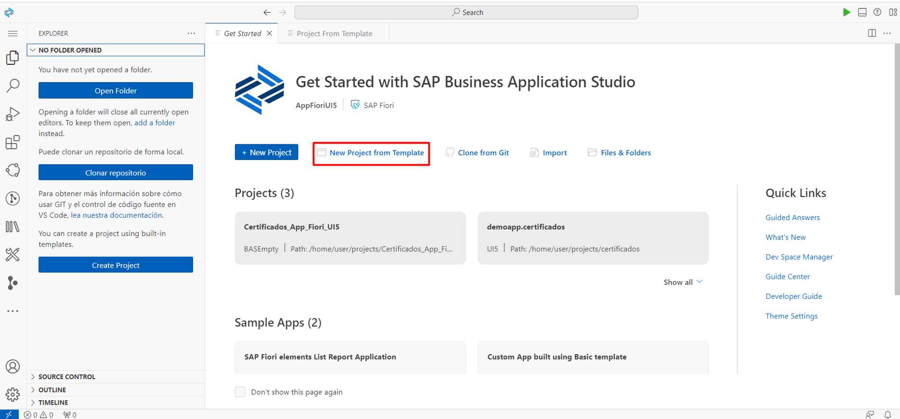
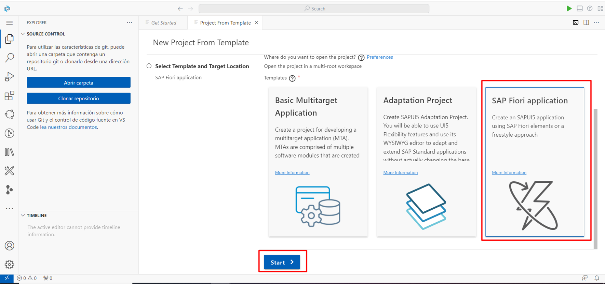
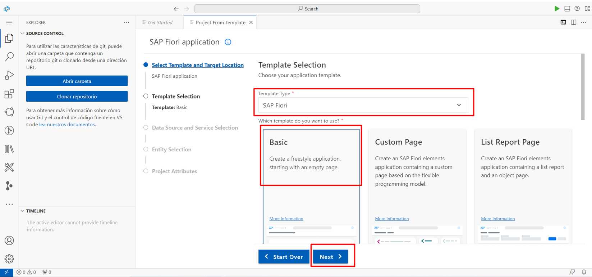
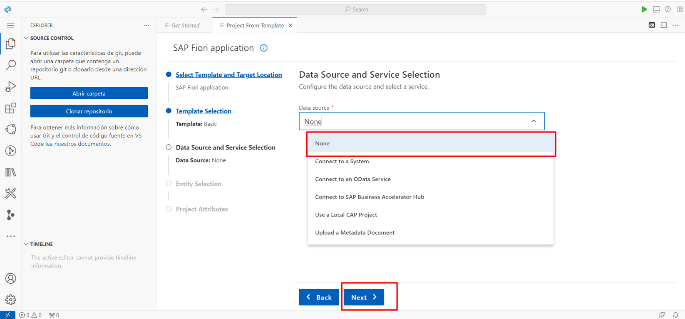
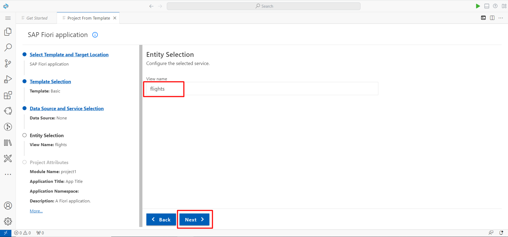
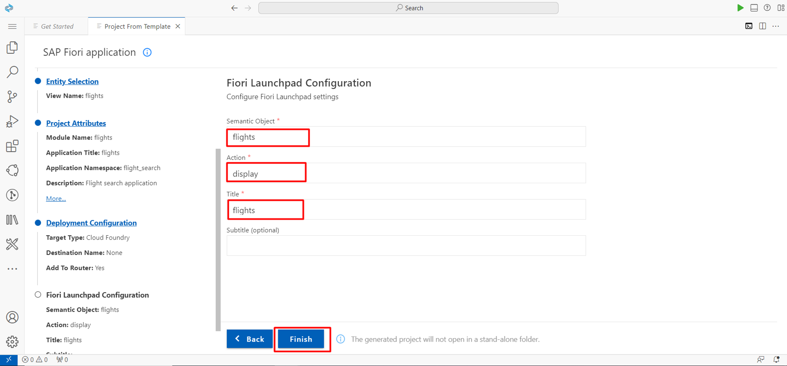
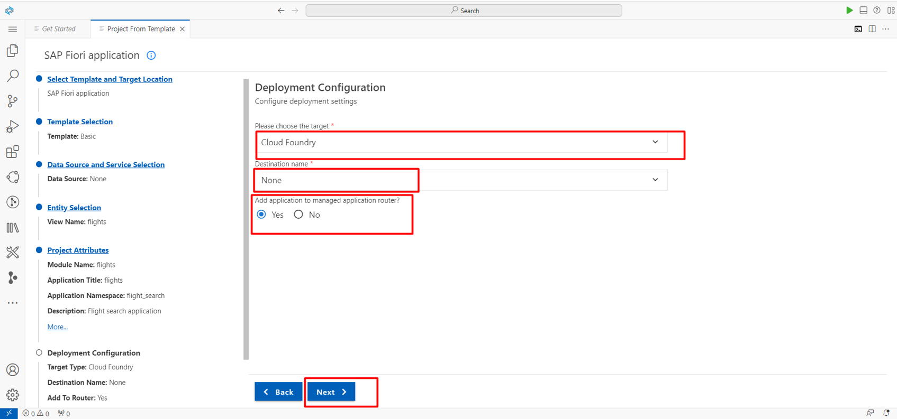
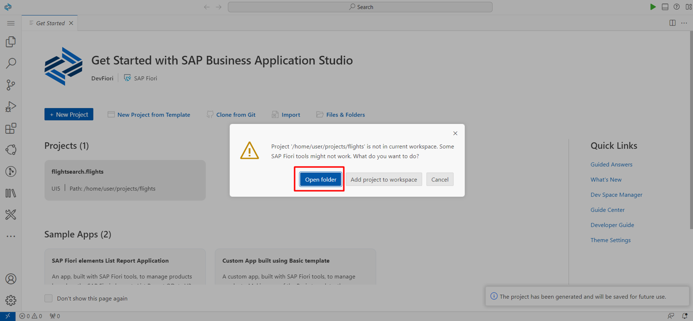
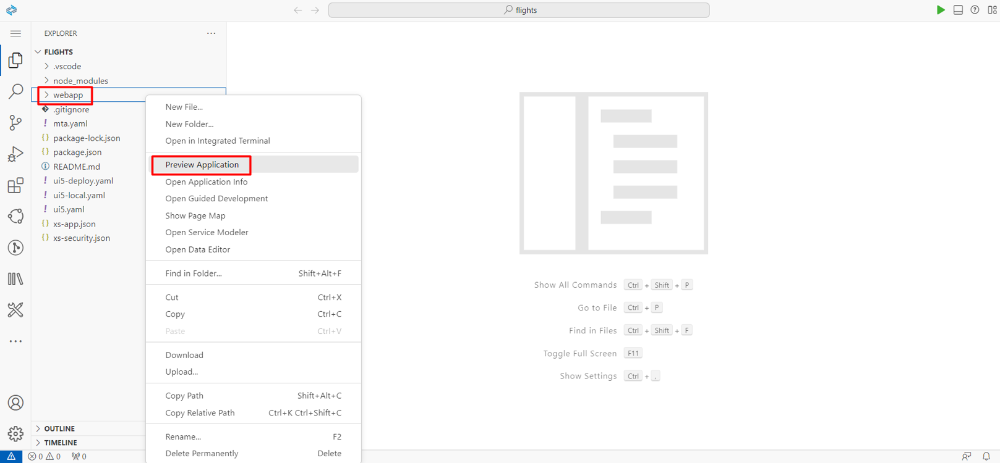
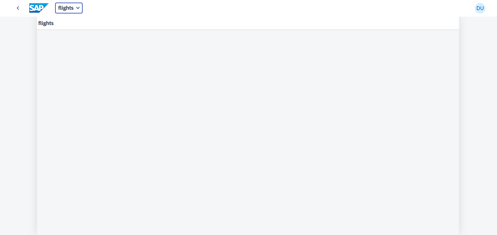

# Ejercicio 1.1 - Crear una Aplicación SAP Fiori Utilizando SAP Business Application Studi

En este ejercicio, desarrollarás una sencilla aplicación SAPUI5 de estilo libre, siguiendo las directrices de diseño de SAP Fiori.nes. 

 

### Paso 1: Crear una aplicación SAPUI5 a partir de una plantilla

Utilizando el asistente de creación de aplicaciones, en cualquier momento puede hacer clic en el botón Atrás para volver al paso anterior, o hacer clic en un paso específico del asistente para volver a ese paso.

1. En la pestañas *Get Started* click **Start from template**.

   

2. Seleccione  **SAP Fiori Application**, y click **Start**.

   

3. En la *Template Selection* screen, seleccione *Application Type* **SAPUI5 freestyle** en el menú desplegable

   
   
4. Para *Data Source and Service Selection*, seleccione **None** del menú desplegable, ya que para esta sencilla aplicación no consumirá ningún dato de un sistema backend. A continuación, haga clic en **Next**.

   

5. En el siguiente paso, puede elegir un nombre para la vista UI5 que se generará por defecto. Usted puede simplemente mantener View1 aquí y haga clic en **Next**.

   

6. Seleccione lo siguiente **Project Attributes**, y haga click en **Next**.

    | Step | Parameter | Value |
    |:-----|:----------|:------|
    | A | Module name | **`certificaciones1`** |
    | B | Application title | **Certificaciones** |
    | C | Application namespace | **ejerfiori** |
    | D | Description | **Aplicacion Fiori** |
    | E | Project folder path | **`/home/user/projects`** (default)|
    | F | Minimum SAPUI5 version | **1.102.1** (default) |
    | G | Add deployment configuration | **Yes**|
    | H | Add FLP configuration | **Yes** |
    | I | Configure advanced options | **No** (default) |

   
    
7. Para **Deployment Configuration**, seleccione **Cloud Foundry** del menú desplegable de destino y deje que el *Destination Name* como **None** por defecto. Click **Next**. Seleccione el **Yes** botón de radio para la última entrada `Add Application to managed application router?`

   

8. Finalmente, en la **Fiori Launchpad Configuration** pantalla, seleccione lo siguiente y haga click en **Finish**. 

    | Step | Parameter | Value |
    |:-----|:----------|:------|
    | A | Semantic Object | **helloworld** |
    | B | Action | **display** |
    | B | Title | **My Hello World** |
    | B | Subtitle (optional) | **Custom UI5 App** |

    

9. Espere a que finalice la instalación de las dependencias del proyecto. Aparecerá una notificación de que "The project has been generated" en la parte inferior derecha de la pantalla. Aparecerá una ventana emergente como la que se muestra a continuación. Seleccione **open folder** para ver la estructura de carpetas del proyecto generado en el área de trabajo.
    
    

 

### Paso 2: Ejecutar la aplicación localmente en el espacio de desarrollo

Para probar su aplicación, ahora puede ejecutarla localmente en SAP Business Application Studio.

1.	En la izquierda *Explorer* panel, haga clic con el botón derecho del ratón en **webapp** y seleccione **Preview Application** del menú contextual.
    

2.	Seleccione la primera entrada **`Start fiori run...`** para ejecutar la aplicación localmente en un shell sandbox launchpad.

    )

3. Ahora debería ver la aplicación con el título de cabeceraw como *certificaciones*. No se ve ningún otro contenido, ya que no hemos añadido ningún otro elemento de interfaz de usuario al área de contenido.

 >Si su navegador no permite abrir una nueva pestaña, es posible que vea un mensaje en la esquina superior izquierda con un enlace donde puede permitir abrir una nueva pestaña.
   
   
   
 

